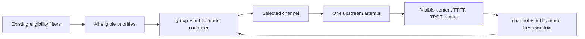

# Dynamic model routing

## Goal

Improve streaming user experience by adapting routing for each public model from
fresh `channel + model` TTFT and TPOT observations, while preserving the existing
channel eligibility, priority, weight, and retry contracts.

The feature is disabled by default. Disabled mode must be behaviorally identical
to the existing static selector.

## Identity and scope

- Observation identity: `channel_id + public_model`. It deliberately does not
  include an endpoint class, user, token, session, or group.
- Allocation identity: `group + public_model`, because eligible channels and
  effective priority/weight are group-specific.
- Only fresh samples count. A window is bounded by both `max_samples` and
  `max_age`; neither bound substitutes for the other.
- Missing TTFT or TPOT is unknown, not zero. Client-caused validation failures do
  not reduce channel health.
- Existing request-path, video-resolution, asset-replica, channel-status, model
  mapping, and specific-channel constraints run before dynamic scoring.
- Dynamic scoring is limited to streaming text-generation routes, where visible
  TTFT and TPOT can actually be measured. Non-streaming, embedding, image,
  audio, realtime, and asynchronous task routes retain the static selector and
  affinity behavior.
- When dynamic routing is active for an eligible request, channel affinity is
  intentionally bypassed so a stale pin cannot keep traffic on a degraded
  channel.

## Runtime path



The dynamic controller is used for both the initial selection and eligible
retries. A retry evaluates the same complete candidate set and health state but
excludes channels already attempted by that request; this avoids retrying the
same dynamically promoted channel and does not mutate the route's global
candidate fingerprint. A specific-channel request bypasses both dynamic
selection and observation.

## Channel-model capacity admission

RPM and TPM are proactive capacity constraints, not health scores. They are
configured as channel defaults and may be overridden for an individual model
alongside priority and weight. An override left blank inherits the channel
default; an explicit `0` means unlimited.

- Identity is `channel_id + public_model`, matching the performance observation
  identity.
- Each key uses a fixed Unix-epoch-aligned one-minute window. It is not a
  rolling sixty-second window.
- RPM counts admitted relay attempts. TPM counts reserved tokens. Admission is
  atomic: a request is accepted only when both the next RPM and TPM totals
  remain within their limits.
- A capacity-denied channel is excluded immediately and selection continues
  through the remaining same-priority and lower-priority channels. This does
  not consume an upstream retry and does not produce a TTFT/TPOT or hard-failure
  observation.
- If every eligible channel is full, the gateway returns a local HTTP 429 with
  error code `channel_model_capacity_exhausted` and a `Retry-After` value up to
  the next minute boundary. A specifically forced channel is never silently
  replaced; it receives the same local 429 when full.
- When Redis is enabled, one Lua operation checks and increments RPM and TPM so
  all gateway replicas share the same Redis-server-time window even when their
  local clocks differ. This shared mode requires Redis 3.2 or newer. Without
  Redis, the counters are process-local.
- Admission currently covers synchronous relay requests. Channel tests and
  asynchronous task relays do not consume these counters in this version.
  OpenAI Realtime is also excluded because its WebSocket is upgraded before a
  complete request can be admitted and its session TPM is not known up front.

For text generation, TPM reserves estimated prompt tokens plus the explicit
maximum output tokens. When the client omits an output limit, the gateway uses
an 8192-token safety reservation; an explicitly supplied zero is preserved and
reserves input tokens only. The final reservation is derived from the fully
transformed outbound body, after channel system prompts, format conversion,
handler defaults, and parameter overrides. It also accounts for multi-choice
and Gemini batch output limits. Embeddings, images, and other
non-text-generation routes reserve input tokens only. This is intentionally
conservative: it prevents known capacity oversubscription but may leave unused
tokens in the current minute when the response finishes below its reservation.

Admission is reserved before the physical upstream dispatch. If a later local
step rejects the request, that minute's RPM/TPM reservation is not refunded;
this favors respecting the configured ceiling over maximizing utilization.

Capacity admission wraps both static and dynamic selection. Priority and weight
still determine the preferred candidate; TTFT/TPOT still determine dynamic
quality allocation; RPM/TPM are the final eligibility gate for the selected
channel-model pair.

## Control behavior

1. Cold start sends primary traffic to the highest static priority and reserves
   a small probe share for lower-priority candidates.
2. A lower-priority candidate may receive production traffic only after enough
   fresh observations establish that it is usable.
3. TTFT and TPOT degradation can promote lower-priority candidates. Static
   weight remains a capacity prior when distributing traffic among similarly
   healthy candidates.
4. Severe degradation sheds traffic faster than mild degradation. Hard upstream
   failures can eject a candidate immediately after a small configurable streak.
5. Recovery is slower than shedding and uses hysteresis/cooldown to prevent
   route flapping.
6. The controller distributes across multiple healthy candidates; it must not
   impose a single-channel throughput ceiling.
7. `aggressiveness` controls the severity-to-shedding response. It is not a fixed
   percentage-point-per-minute rate.

Hard failure is a separate state from ordinary TTFT/TPOT degradation. It
immediately removes production share, holds the channel out for a cooldown,
then grants only a small reprobe share. Recovery requires a fresh successful
metric streak after the hard-failure cooldown; old in-flight completions cannot
clear the ejection.

## Attempt metrics

- Successful streaming attempts measure TTFT from attempt start to the first
  visible content event. Metadata-only SSE frames do not count as a token.
- TPOT is `(last_visible_content - first_visible_content) / (output_tokens - 1)`
  and is omitted when the output token count is unavailable, no greater than
  one, or the stream exposes too little timing information.
- Non-streaming requests are not admitted to dynamic routing; their full
  response time is never treated as TTFT.
- Upstream 429/5xx responses, channel errors, stream timeouts, and scanner
  failures are hard failures after the request actually reached the upstream.
- Local conversion failures and client disconnect/ping termination are
  discarded rather than blamed on the channel.

## Tuned defaults

Production remains disabled by default. The initial values below are the best
accepted parameter set from the deterministic feedback sweep; they are a safe
starting point, not universal constants.

| Option | Default | Meaning |
|---|---:|---|
| `enabled` | `false` | Preserve the existing static selector until explicitly enabled. |
| `max_samples` | `60` | Maximum retained observations per channel and public model. |
| `max_age_seconds` | `90` | Discard samples older than this even when the count is below 60. |
| `min_samples` | `3` | Minimum fresh metric confidence before production promotion. |
| `probe_fraction` | `0.015` | Reserved exploration share; must be positive when enabled. |
| `degradation_threshold` | `1.3` | Relative TTFT/TPOT ratio that starts shedding. |
| `recovery_threshold` | `1.1` | Lower hysteresis boundary for recovery. |
| `critical_threshold` | `1.9` | Relative ratio that triggers severe shedding. |
| `candidate_advantage` | `1.1` | Evidence required before preferring another candidate. |
| `aggressiveness` | `0.90` | Fraction of severity translated into immediate shedding. |
| `recovery_step` | `0.02` | Maximum slow recovery step per eligible control update. |
| `cooldown_seconds` | `3` | Minimum interval between ordinary allocation changes. |
| `hard_failure_threshold` | `1` | Fresh hard failures required for immediate ejection. |
| `hard_failure_cooldown_seconds` | `30` | Hold time before limited hard-failure reprobe. |

## Evaluation contract

The deterministic simulator compares the dynamic controller with the current
static priority-plus-weight selector under identical arrivals and random seeds.
It must cover gradual degradation, sudden outage, capacity aggregation,
transient spikes, stale candidates, recovery, all-channels-bad, and low-traffic
conditions.

The result is acceptable only when the aggregate multi-seed report shows all of
the following, without hiding losing scenarios:

- at least 20% lower TTFT SLO violation area;
- at least 15% lower p95 TTFT in degradation/outage scenarios;
- no lower successful throughput in the capacity aggregation scenario;
- at least 60% fewer post-detection requests exposed to the failed channel;
- no material regression (greater than 5%) in healthy steady-state p95 TTFT or
  success rate;
- no repeated route reversals in the transient-spike and recovery scenarios.

Detection is reported in both elapsed time and completed observations. At low
traffic the controller must report insufficient confidence instead of claiming
an impossible fixed detection latency.

The final `probe-015-m3-age90` sweep passed every gate across seven fixed seeds:

- 51.89% average composite experience improvement and no regressed run;
- 94.74% degradation/outage p95 TTFT improvement;
- 98.11% lower TTFT SLO violation area;
- 95.14% lower bad-channel exposure after detection;
- 1.51% higher capacity-scenario throughput;
- 0.53% healthy steady-state p95 TTFT regression and zero route reversals.

The full accepted report is under
`tools/dynamic-routing-sim/results/round-11-final/`. The protocol test under
`pkg/dynamicrouting/sim/protocol/` uses real HTTP and SSE framing and verifies
metadata-only frames, visible TTFT, TPOT, 429/503, disconnects, and a closed-loop
A-to-B switch.

The deterministic capacity simulation exercises the production selector and
final admission boundary with independent RPM and TPM limits. It verifies that
aggregate admitted throughput matches a separate late-rejection policy model
and that a local capacity error is returned only after every configured
channel-model window is full. It is a capacity-policy simulation, not an HTTP or
upstream-429 integration test.

Run the acceptance sweep from the repository root:

```powershell
go run ./cmd/dynamic-routing-sim `
  -output tools/dynamic-routing-sim/results/local `
  -require-significant
```

## Deployment boundary

Controller observations and allocations are process-local in this version.
Multiple gateway replicas therefore learn independently; the implementation
does not claim Redis-backed cross-instance convergence. Configuration is shared
through the existing option store, but learned samples are not. Deploy disabled,
verify the setting and metrics on one staging or canary instance, then enable it
for production only after that instance is representative.

Silent upstreams can only become hard-failure observations after an outbound or
stream-idle deadline fires. Production deployments should therefore configure a
non-zero `RELAY_TIMEOUT` (the default is unlimited) and keep
`STREAMING_TIMEOUT` non-zero (the current default is 300 seconds). Set these from
the longest legitimate model response and reasoning gaps; an infinite timeout
also means an indefinitely hung attempt cannot teach the controller to switch.

Selection accounting currently advances when middleware chooses a channel,
before later local validation, sensitive-word checks, pricing, and quota
reservation. A request rejected at one of those local gates can therefore
consume a probe turn without reaching upstream or producing an observation.
This does not misclassify channel health, but a workload dominated by local
rejections can learn more slowly. A future reservation/commit boundary at the
physical upstream start is required to eliminate that probe-accounting gap.

Low traffic may never reach confidence within the age window, and when every
channel is bad the controller can only select the least harmful eligible option.
Both cases are reported as neutral/insufficient-confidence outcomes rather than
as successful detection.

Stream ingress queues are bounded by event count and reject oversized individual
events, but they do not yet enforce a cumulative byte budget across queued
events. A cumulative budget and Linux race/slow-writer stress coverage remain
hardening work for a later iteration.

The administrator UI persists all fourteen settings atomically through
`PUT /api/option/dynamic_routing`. The generic single-option endpoint rejects
this prefix so interdependent thresholds and enable/probe constraints cannot be
partially published.

## Rollout

1. Pure deterministic simulation and parameter search (complete).
2. Protocol-level SSE fault injection with programmable first-token and
   per-token delay (complete).
3. Disabled-by-default production integration (complete).
4. One-instance staging/canary observation, followed by an explicit enable.
